# E-commerce Platform System Workflows Documentation

## Overview

This document provides comprehensive documentation of the core workflows within the e-commerce platform, covering five key modules: Subscription & Commission Management, Product Catalogue & Policy Oversight, Shipment & Logistics Configuration, Payout & Transaction Management, and Admin Dashboard & Reports.

---

## 1. Subscription & Commission Management

### 1.1 Subscription Management Workflow

#### 1.1.1 Subscription Plan Creation
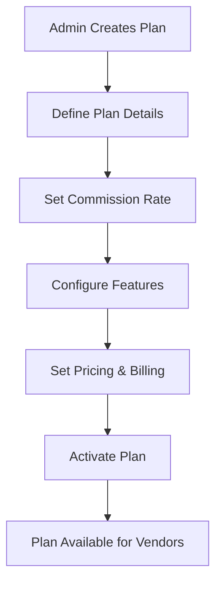

**Process Steps:**
1. **Plan Definition**: Admin creates subscription plan with tier (STARTER, BASIC, PREMIUM, ENTERPRISE)
2. **Commission Configuration**: Set commission rate (5-10% based on tier)
3. **Feature Configuration**: Define plan features (max products, orders, etc.)
4. **Pricing Setup**: Set price and billing cycle (MONTHLY/YEARLY)
5. **Trial Configuration**: Set trial days (default 0)
6. **Activation**: Mark plan as active and optionally popular

**Key Entities:**
- `SubscriptionPlan`: Plan configuration with commission rates
- `Subscription`: Vendor's active subscription
- `SubscriptionTier`: Enum (STARTER, BASIC, PREMIUM, ENTERPRISE)

#### 1.1.2 Vendor Subscription Workflow
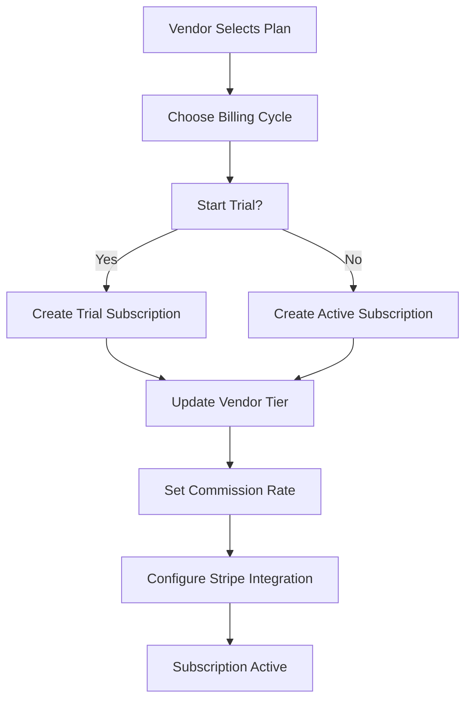

**Process Steps:**
1. **Plan Selection**: Vendor chooses subscription plan
2. **Billing Configuration**: Select billing cycle (MONTHLY/YEARLY)
3. **Trial Option**: Option to start with trial period
4. **Subscription Creation**: Create subscription record
5. **Vendor Update**: Update vendor's subscription tier and commission rate
6. **Payment Integration**: Configure Stripe subscription
7. **Activation**: Subscription becomes active

**API Endpoints:**
- `POST /api/subscriptions` - Create subscription
- `GET /api/subscriptions` - Get vendor subscription
- `PUT /api/subscriptions/[id]` - Update subscription
- `DELETE /api/subscriptions/[id]` - Cancel subscription

### 1.2 Commission Management Workflow

#### 1.2.1 Commission Calculation Process
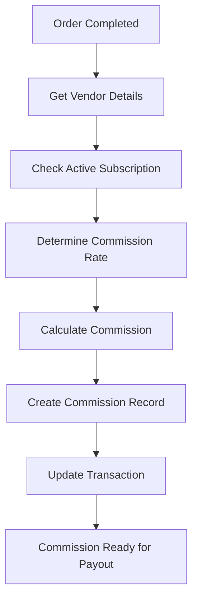

**Process Steps:**
1. **Order Completion**: Order status changes to completed
2. **Vendor Lookup**: Get vendor's current subscription tier
3. **Rate Determination**: Use subscription-based rate or custom rate
4. **Calculation**: Calculate commission amount and net payout
5. **Record Creation**: Create commission record with status 'CALCULATED'
6. **Transaction Update**: Update transaction with commission details

**Commission Rates by Tier:**
- STARTER: 10% (default)
- BASIC: 10%
- PREMIUM: 8%
- ENTERPRISE: 5%

#### 1.2.2 Commission Processing Workflow
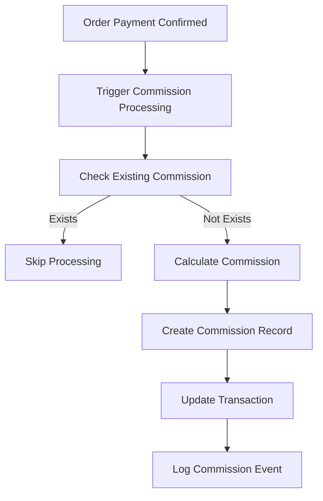

**Key Services:**
- `CommissionService.calculateCommission()` - Calculate commission for order
- `CommissionService.processCommission()` - Process commission after order completion
- `CommissionService.getCommissionSummary()` - Get vendor commission summary

---

## 2. Product Catalogue & Policy Oversight

### 2.1 Product Creation & Approval Workflow

#### 2.1.1 Product Submission Process
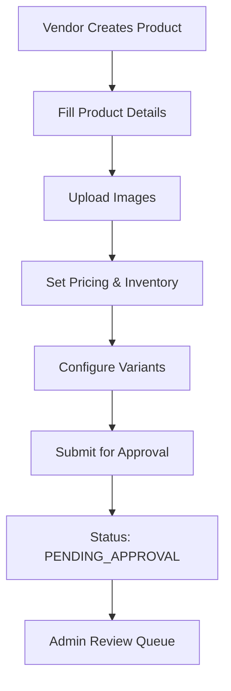

**Process Steps:**
1. **Product Creation**: Vendor fills product form with required details
2. **Image Upload**: Upload product images
3. **Pricing Setup**: Set price, SKU, and inventory levels
4. **Variant Configuration**: Create product variants if needed
5. **Submission**: Product submitted with status 'PENDING_APPROVAL'
6. **Queue Addition**: Product added to admin approval queue

**Required Fields:**
- Name, description, price, category
- Inventory levels, weight, dimensions
- Shipping requirements, digital/physical classification

#### 2.1.2 Product Approval Workflow
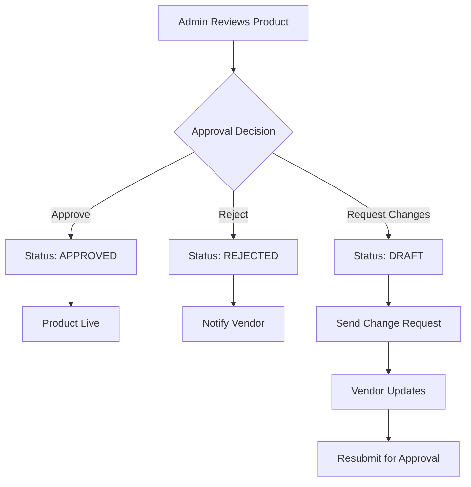

**Process Steps:**
1. **Admin Review**: Admin reviews product details, images, and compliance
2. **Decision Making**: Choose approve, reject, or request changes
3. **Status Update**: Update product status accordingly
4. **Notification**: Send email notification to vendor
5. **Audit Logging**: Log approval action for compliance
6. **Metadata Update**: Store approval notes and reviewer information

**Approval Actions:**
- **APPROVE**: Product goes live immediately
- **REJECT**: Product rejected with reason
- **REQUEST_CHANGES**: Product returned to draft with specific changes

### 2.2 Policy Oversight & Compliance

#### 2.2.1 Policy Violation Detection
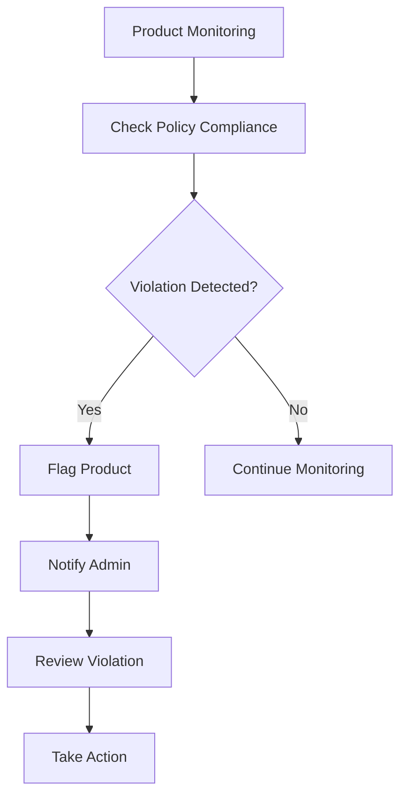

**Policy Areas:**
- Content compliance (descriptions, images)
- Pricing policies and fair competition
- Category-specific requirements
- Intellectual property compliance
- Safety and regulatory compliance

#### 2.2.2 Category Management
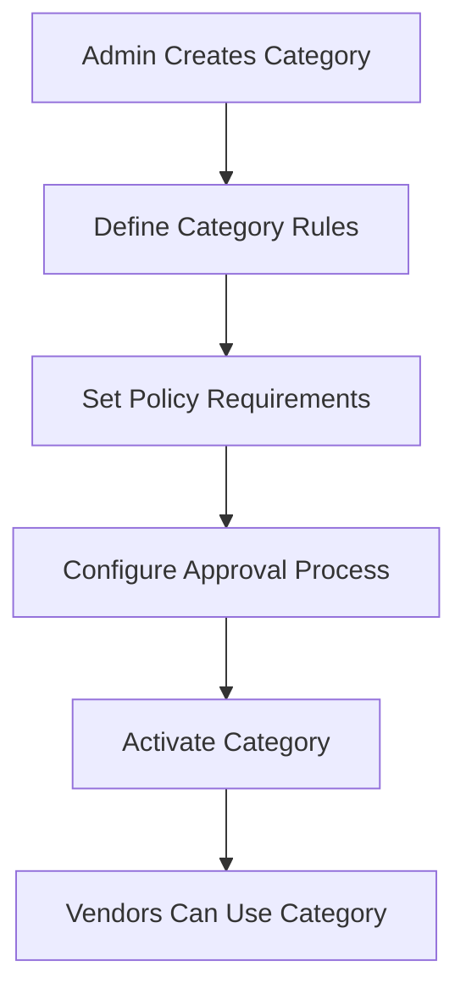

**Category Features:**
- Policy rules configuration
- Approval requirements
- Commission rate overrides
- Feature restrictions

---

## 3. Shipment & Logistics Configuration

### 3.1 Logistics Configuration Workflow

#### 3.1.1 Vendor Logistics Setup
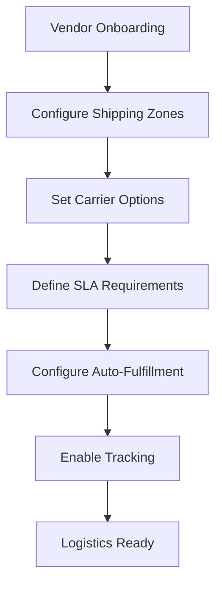

**Process Steps:**
1. **Zone Configuration**: Define shipping zones with rates
2. **Carrier Setup**: Configure supported carriers (LBC, J&T, etc.)
3. **SLA Definition**: Set delivery timeframes by zone
4. **Auto-Fulfillment**: Configure automatic order fulfillment
5. **Tracking Setup**: Enable package tracking features

**Configuration Elements:**
- **Shipping Zones**: Metro Manila, Luzon, Visayas & Mindanao
- **Carriers**: LBC Express, J&T Express, 2GO, GrabExpress
- **SLA Definitions**: Standard (3-5 days), Express (1-2 days), Overnight

#### 3.1.2 Order Fulfillment Workflow
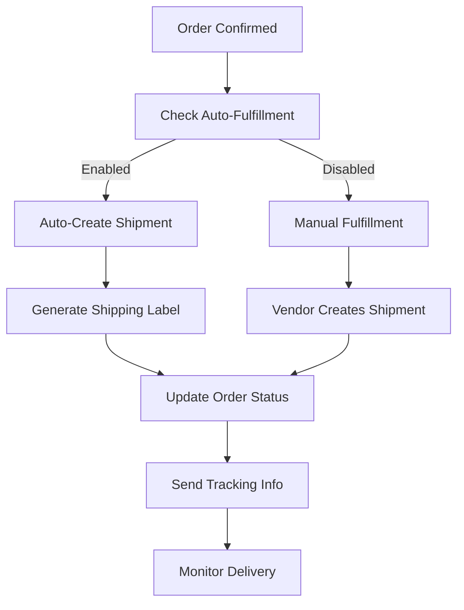

**Process Steps:**
1. **Order Confirmation**: Order payment confirmed
2. **Fulfillment Check**: Check if auto-fulfillment is enabled
3. **Shipment Creation**: Create shipment record
4. **Label Generation**: Generate shipping label
5. **Status Update**: Update order and shipment status
6. **Tracking**: Provide tracking information to customer

### 3.2 Shipping Integration

#### 3.2.1 Multi-Carrier Support
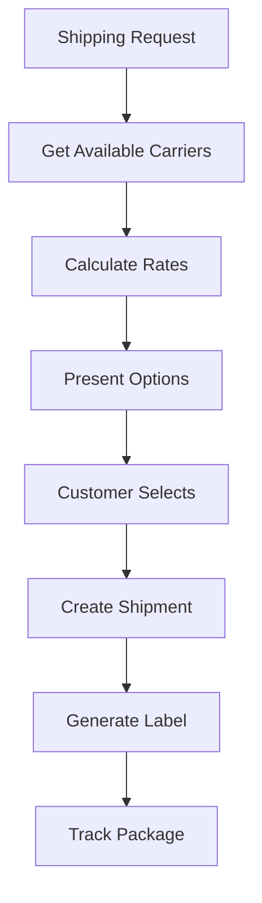

**Supported Carriers:**
- **LBC Express**: Nationwide coverage, multiple service levels
- **J&T Express**: Fast delivery, competitive rates
- **2GO**: Logistics and shipping solutions
- **GrabExpress**: On-demand delivery service

**Features:**
- Real-time rate calculation
- Label generation
- Package tracking
- Webhook integration for status updates

---

## 4. Payout & Transaction Management

### 4.1 Transaction Processing Workflow

#### 4.1.1 Order Payment Processing
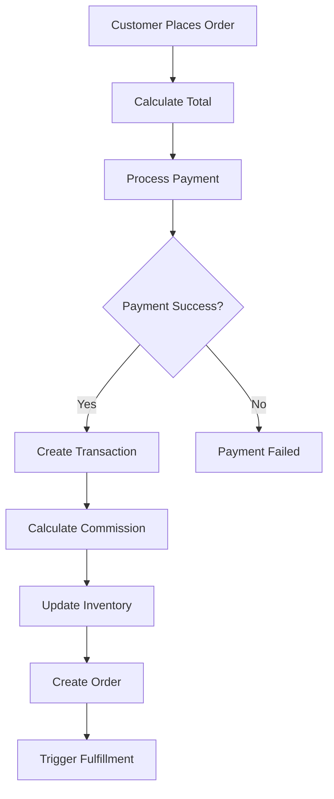

**Process Steps:**
1. **Order Creation**: Customer places order with items
2. **Payment Processing**: Process payment through Stripe
3. **Transaction Creation**: Create transaction record
4. **Commission Calculation**: Calculate platform commission
5. **Inventory Update**: Update product inventory levels
6. **Order Completion**: Mark order as confirmed

**Transaction Types:**
- ORDER: Customer purchase
- COMMISSION: Platform commission
- PAYOUT: Vendor payment
- REFUND: Order refund

#### 4.1.2 Commission & Payout Calculation
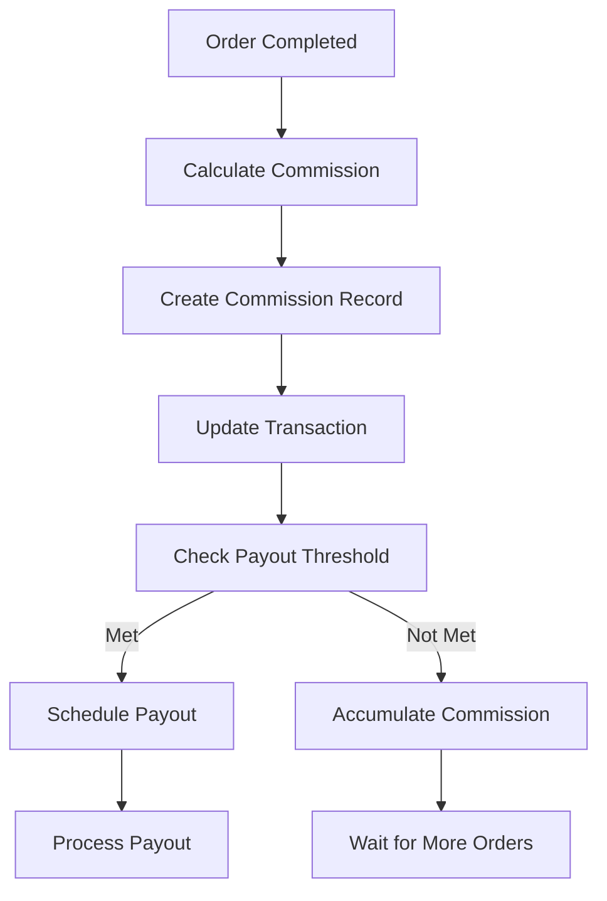

**Calculation Logic:**
- Commission = Order Total × Commission Rate
- Net Payout = Order Total - Commission
- Payout threshold: Minimum amount before payout

### 4.2 Automated Payout System

#### 4.2.1 Payout Scheduling Workflow
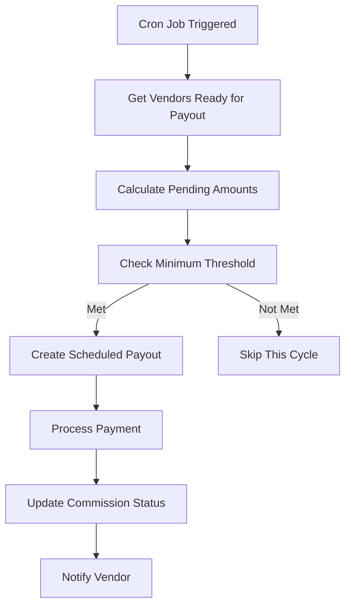

**Process Steps:**
1. **Scheduled Check**: Cron job runs based on vendor frequency
2. **Vendor Selection**: Get vendors ready for payout
3. **Amount Calculation**: Calculate total pending payout
4. **Threshold Check**: Verify minimum payout amount
5. **Payout Creation**: Create scheduled payout record
6. **Payment Processing**: Execute payment via Stripe or bank transfer
7. **Status Update**: Update commission and payout status
8. **Notification**: Send email notification to vendor

**Payout Frequencies:**
- DAILY: Daily payouts for high-volume vendors
- WEEKLY: Weekly payouts (default)
- MONTHLY: Monthly payouts for smaller vendors

#### 4.2.2 Payment Processing
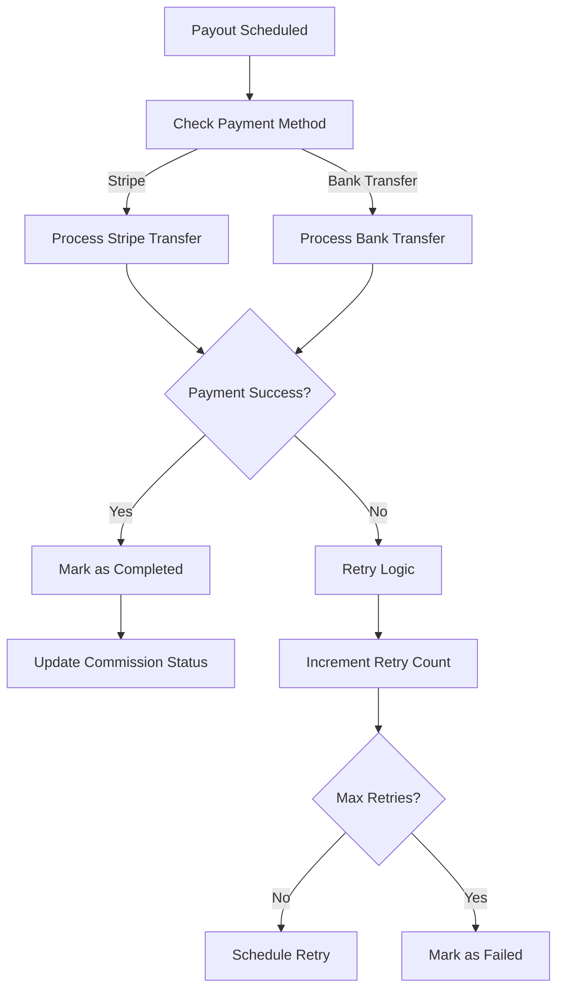

**Payment Methods:**
- **Stripe**: Direct transfer to vendor's Stripe account
- **Bank Transfer**: Direct bank transfer
- **PayPal**: PayPal transfer (future implementation)

**Retry Logic:**
- Maximum 3 retry attempts
- Exponential backoff between retries
- Failure notification after max retries

---

## 5. Admin Dashboard & Reports

### 5.1 Admin Dashboard Workflow

#### 5.1.1 Dashboard Overview
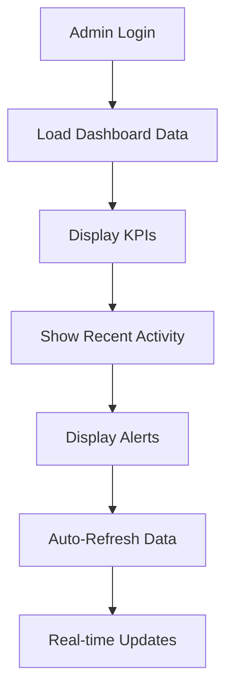

**Dashboard Components:**
- **KPI Cards**: Revenue, orders, vendors, customers
- **Recent Activity**: Latest orders, approvals, issues
- **Alerts**: System alerts and notifications
- **Charts**: Performance trends and analytics
- **Quick Actions**: Common admin tasks

#### 5.1.2 Real-time Monitoring
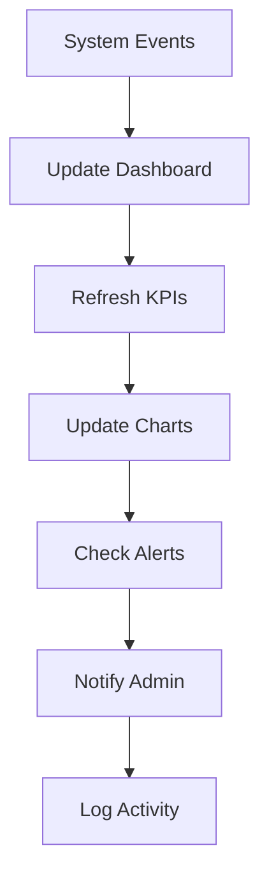

**Monitoring Areas:**
- Order processing status
- Payment processing
- System performance
- Error rates
- User activity

### 5.2 Analytics & Reporting System

#### 5.2.1 Comprehensive Analytics Workflow
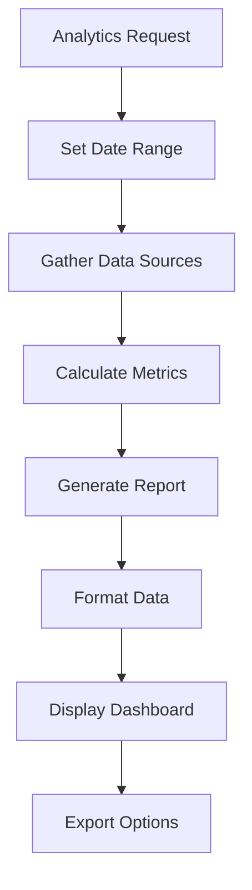

**Analytics Categories:**
- **Revenue Analytics**: Sales, commissions, growth
- **Customer Analytics**: Acquisition, retention, behavior
- **Vendor Performance**: Sales, fulfillment, ratings
- **Product Analytics**: Top sellers, inventory, trends
- **Platform Metrics**: System performance, usage

#### 5.2.2 Report Generation Process
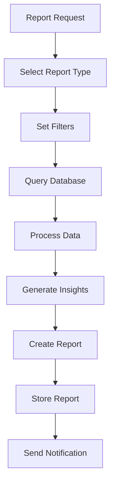

**Report Types:**
- **Revenue Reports**: Financial performance analysis
- **Vendor Reports**: Vendor performance and compliance
- **Product Reports**: Product performance and trends
- **Customer Reports**: Customer behavior and segmentation
- **Operational Reports**: System performance and logistics

### 5.3 Audit & Compliance

#### 5.3.1 Audit Logging Workflow
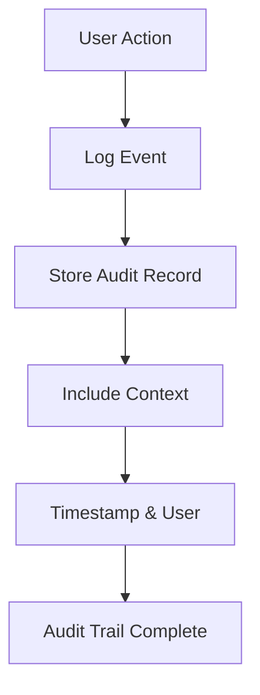

**Audited Actions:**
- Product approvals/rejections
- Vendor verifications
- Payment processing
- System configuration changes
- User management actions

**Audit Record Fields:**
- User ID and action
- Resource type and ID
- Timestamp and IP address
- Action details and context
- Before/after states

---

## Integration Points

### Cross-Module Dependencies

1. **Subscription → Commission**: Subscription tier determines commission rates
2. **Product → Commission**: Product sales generate commissions
3. **Order → Payout**: Completed orders contribute to vendor payouts
4. **Logistics → Order**: Shipping status affects order completion
5. **Analytics → All Modules**: Dashboard aggregates data from all systems

### API Integration

**Core Services:**
- `SubscriptionService`: Manages vendor subscriptions
- `CommissionService`: Handles commission calculations
- `PayoutService`: Processes vendor payments
- `AnalyticsService`: Generates reports and insights
- `ShipmentService`: Manages logistics and shipping

**External Integrations:**
- **Stripe**: Payment processing and payouts
- **Email Service**: Notifications and communications
- **Shipping Carriers**: Label generation and tracking
- **Analytics Tools**: Data visualization and reporting

---

## Security & Compliance

### Data Protection
- All financial data encrypted in transit and at rest
- PCI DSS compliance for payment processing
- GDPR compliance for customer data
- Audit trails for all financial transactions

### Access Control
- Role-based access control (RBAC)
- Admin, Vendor, Customer role separation
- API authentication and authorization
- Session management and timeout

### Monitoring & Alerts
- Real-time system monitoring
- Automated alert system
- Performance metrics tracking
- Error logging and reporting

---

## Conclusion

This comprehensive workflow documentation provides a complete overview of the e-commerce platform's core systems. Each module is designed to work independently while maintaining strong integration points for seamless operation. The system supports scalability, security, and compliance requirements while providing excellent user experience for all stakeholders.

For technical implementation details, refer to the individual service files and API documentation in the codebase.
